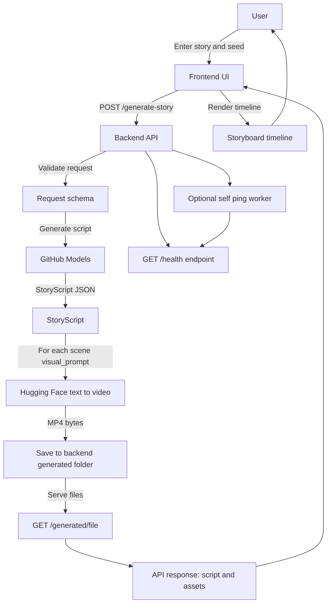

# Narrative-to-Visual Story Agent

Turn a free-form story into a director-style storyboard, and generate a visual asset per scene (via Hugging Face Inference Providers).

## Project flow (architecture)

- Frontend entry: `frontend/src/App.jsx` (calls backend and renders storyboard)
- Backend entry: `backend/main.py` (FastAPI + generation pipeline)
- Main endpoint: `POST /generate-story`
- Static assets: `GET /generated/<filename>` (served from `backend/generated/`)

## Run the project

See the step-by-step guide here: [`RUN.md`](./RUN.md).

## Local development

- Backend: FastAPI service (generates the script + calls the HF text-to-video endpoint).
- Frontend: Vite + React UI (shows the progress tracker and the per-scene assets).

## Deployment note (Render)

The backend exposes `GET /health` and (optionally) can self-ping to reduce idle sleep during demos.
For extra reliability, you can also use an external uptime monitor to hit:

- `https://<your-render-service>.onrender.com/health`

