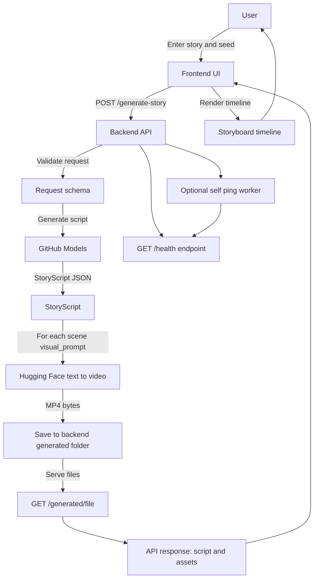

# Narrative-to-Visual Story Agent

Turn a free-form story into a director-style storyboard, and generate a visual asset per scene (via Hugging Face Inference Providers).

## Submission links

- **Demo video**: https://drive.google.com/file/d/1z_EGocZHYqB8uF7zqqALN7zZPHwhBhWg/view?usp=sharing
- **Deployed interface**: https://narrative-to-visual-story-agent.vercel.app/

## Short technical note (architecture, decisions, trade-offs)

- **Architecture**: React (Vite) frontend calls a FastAPI backend. Backend uses GitHub Models to convert the user story into a strict `StoryScript` JSON schema (5–10 scenes). For each scene, backend calls Hugging Face Inference Providers `text_to_video`, stores the MP4 under `backend/generated/`, and returns the script + per-scene asset URLs.
- **Key decisions**:
  - **Strict JSON contract with Pydantic** to keep the UI simple and deterministic (schema validation guards against LLM formatting issues).
  - **Backend-served static assets** (`/generated/<file>`) so the frontend only needs a URL to render each scene.
  - **Retry/backoff for cold-starts** on hosted inference (handles “model loading”/503 conditions more gracefully).
  - **CORS configurable by env** to support local dev and deployment with minimal changes.
- **Trade-offs**:
  - **Sequential generation per scene** is simpler and keeps provider usage predictable, but increases total latency for 8–10 scenes.
  - **Provider cold starts** can still cause multi-minute waits; the UI focuses on “progress states” while users wait.
  - **Video-only assets** are currently produced (MP4); extending to images would be straightforward but adds UI and branching complexity.

## Project flow (architecture)



- Frontend entry: `frontend/src/App.jsx` (calls backend and renders storyboard)
- Backend entry: `backend/main.py` (FastAPI + generation pipeline)
- Main endpoint: `POST /generate-story`
- Static assets: `GET /generated/<filename>` (served from `backend/generated/`)

## Run the project

See the step-by-step guide here: [`RUN.md`](./RUN.md).

## Test instructions for evaluators (local)

### Prerequisites

- **Node.js**: 18+ recommended
- **Python**: 3.10+ recommended
- **API keys**:
  - GitHub Models token (`GITHUB_TOKEN`)
  - Hugging Face token with Inference Providers access (`HF_TOKEN`)

### Start backend (FastAPI)

From the repo root in PowerShell:

```powershell
cd ".\backend"
python -m venv .venv
.\.venv\Scripts\Activate.ps1
pip install -r requirements.txt
copy .env.example .env
```

Edit `backend\.env` and set real keys, then run:

```powershell
uvicorn main:app --reload --port 8000
```

Sanity check:

- `GET` `http://127.0.0.1:8000/health` should return `{"status":"ok"}`

### Start frontend (Vite + React)

In a new terminal from the repo root:

```powershell
cd ".\frontend"
npm install
copy .env.example .env
npm run dev
```

Open:

- `http://localhost:5173`

### Basic evaluation flow

1. Paste any short story (5–15 lines works well).
2. Click **Generate Visual Story**.
3. Expected results:
   - A storyboard **title** and **5–10 scenes** appear.
   - Each scene renders an MP4 (served from backend `/generated/...`).
   - If the provider is cold-starting, the request may take minutes; retry is built-in for common “loading” cases.

### Troubleshooting (common)

- **403 from Hugging Face**: the `HF_TOKEN` likely lacks Inference Providers permissions.
- **CORS errors**: ensure `FRONTEND_ORIGIN=http://localhost:5173` in `backend\.env`, then restart backend.
- **Connection refused**: confirm backend is running on port 8000 and `VITE_BACKEND_URL` matches it.

## Local development

- Backend: FastAPI service (generates the script + calls the HF text-to-video endpoint).
- Frontend: Vite + React UI (shows the progress tracker and the per-scene assets).

## Deployment note (Render)

The backend exposes `GET /health` and (optionally) can self-ping to reduce idle sleep during demos.
For extra reliability, you can also use an external uptime monitor to hit:

- `https://narrative-to-visual-story-agent.onrender.com/health`

